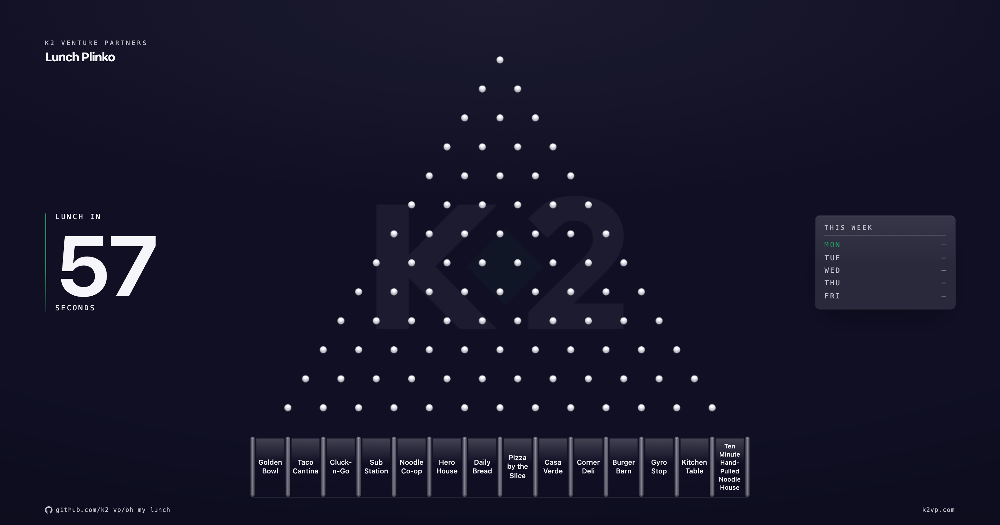

<p align="center">
  
</p>

# Lunch Plinko

A plinko board for the office TV. It picks where the team eats lunch, and nobody gets to argue with a ball.

Every day the board counts down, drops five balls through a peg lattice, and lands on one restaurant from your list. The winner is drawn fairly before any ball moves. The physics is the show, not the decision. [Here is why that matters](docs/explanation/fairness.md).

## How a day plays out

1. The board counts down from 60 seconds.
2. Five balls drop, one at a time. Each ball lands in a lane and counts as one vote.
3. The lane with the most balls wins. A tie sends one deciding ball through a board with only the tied lanes open.
4. Press Enter to lock the winner in. If the room groans, press R to reject it and drop again. You get one re-drop per day, and the second result is final.
5. The winner joins the week panel and sits out until Monday. By Friday the board has picked five different places.

## Quick start

You need Node 22.18 or newer.

```bash
npm install
npm run dev
```

Open http://127.0.0.1:5173 and watch the first drop. The board ships with a sample list, so the next step is to [put your own spots on it](docs/how-to/edit-the-lunch-list.md).

## Configuration

One file owns the list and the settings: `data/restaurants.json`.

```json
{
  "restaurants": [
    { "name": "Golden Bowl" },
    { "name": "Ten Minute Hand-Pulled Noodle House", "short": "Noodles" }
  ]
}
```

Two to fifteen restaurants fit on the board. Every setting has a default, so the `settings` block is optional. The [configuration reference](docs/reference/configuration.md) lists every field, including the theme colors.

## On the office TV

```bash
npm run build
npm start
```

The server listens on port 4173 and remembers the week's winners in `data/state.json`. The [TV guide](docs/how-to/put-it-on-the-office-tv.md) covers the rest.

## Documentation

| | |
|---|---|
| First run, start to finish | [Getting started](docs/tutorials/getting-started.md) |
| Change the list | [Edit the lunch list](docs/how-to/edit-the-lunch-list.md) |
| Run it on a TV | [Put it on the office TV](docs/how-to/put-it-on-the-office-tv.md) |
| Reset a day, reopen a day, re-drop | [Manage a day](docs/how-to/manage-a-day.md) |
| Every config field | [Configuration](docs/reference/configuration.md) |
| Server endpoints | [HTTP API](docs/reference/http-api.md) |
| Keys and URL parameters | [Controls](docs/reference/controls.md) |
| Why the draw is fair | [Fairness](docs/explanation/fairness.md) |
| How the code fits together | [Architecture](docs/explanation/architecture.md) |

## Development

```bash
npm test           # simulation proofs plus browser rendering tests
npm run typecheck
```

The stack is TypeScript, Vite, and Three.js, with a dependency-free Node server. The test suite includes the fairness proofs: millions of draws, checked for uniform results.

Built at [K2 Venture Partners](https://k2vp.com) to settle the daily lunch debate.
